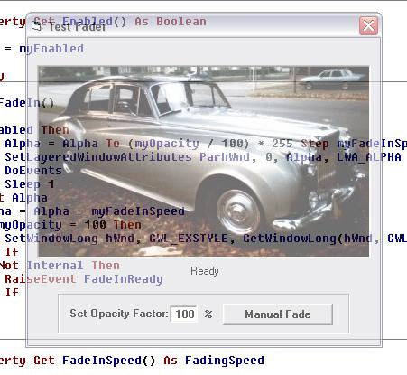



## Form Fader OCX control \(updated\)

### Description

This is a Form Fader OCX control. Simply stick it on a form, set a few properties, and with two lines of code it will fade-in and fade-out the form smoothly. Also lets you fade the form by setting a fading (opacity) factor between 25% and 100%. Semi-transparent forms can be moved across the background with a realistic transparent effect. The Fader can be compiled separately, of course. This OCX Control is based on code by Ed Preston (and he deserves the votes).
 
### More Info
 

             |
---                |---
**Submitted On**   |2002-08-21 11:50:34
**By**             |[ULLI](https://github.com/Planet-Source-Code/PSCIndex/blob/master/ByAuthor/ulli.md)
**Level**          |Intermediate
**User Rating**    |4.5 (27 globes from 6 users)
**Compatibility**  |VB 6\.0
**Category**       |[Graphics](https://github.com/Planet-Source-Code/PSCIndex/blob/master/ByCategory/graphics__1-46.md)
**World**          |[Visual Basic](https://github.com/Planet-Source-Code/PSCIndex/blob/master/ByWorld/visual-basic.md)
**Archive File**   |[Form\_Fader1205898212002\.zip](https://github.com/Planet-Source-Code/ulli-form-fader-ocx-control-updated__1-38108/archive/master.zip)

